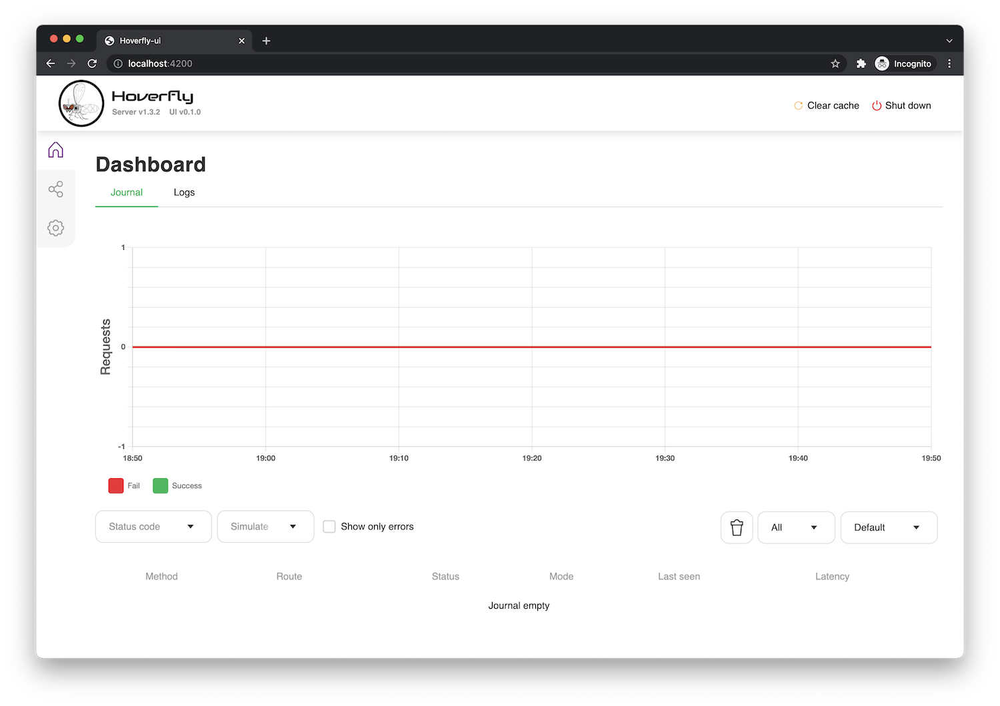
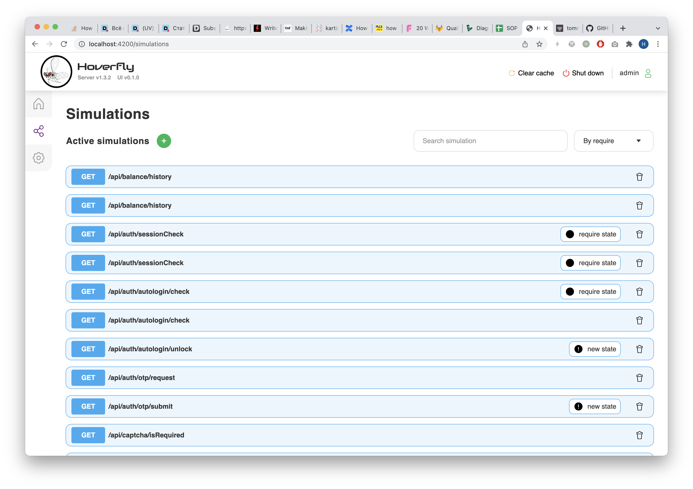
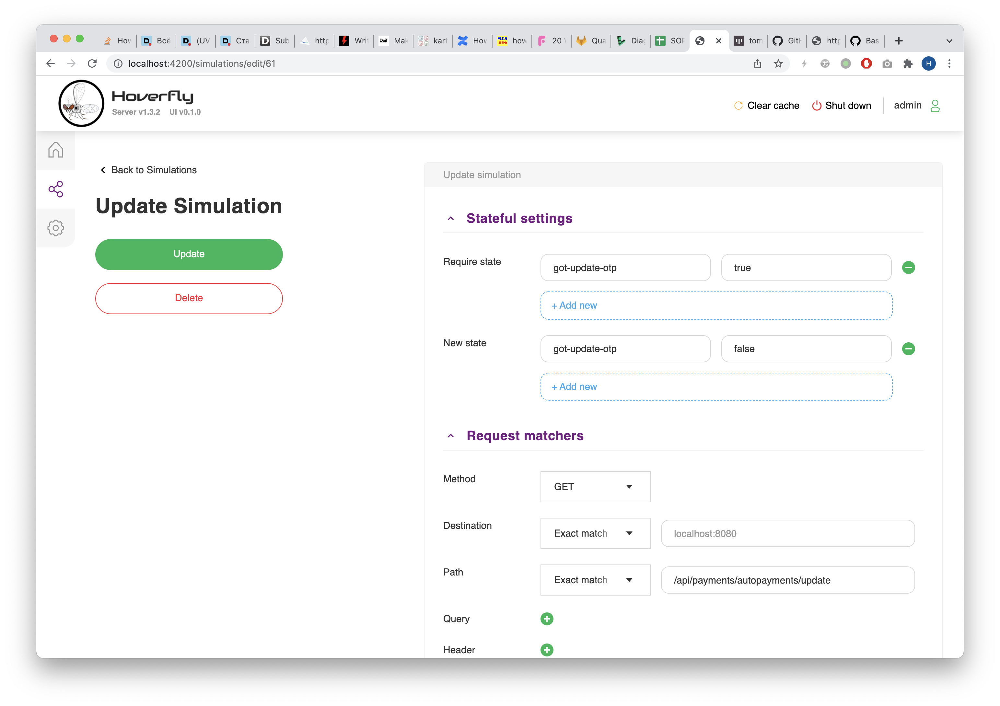
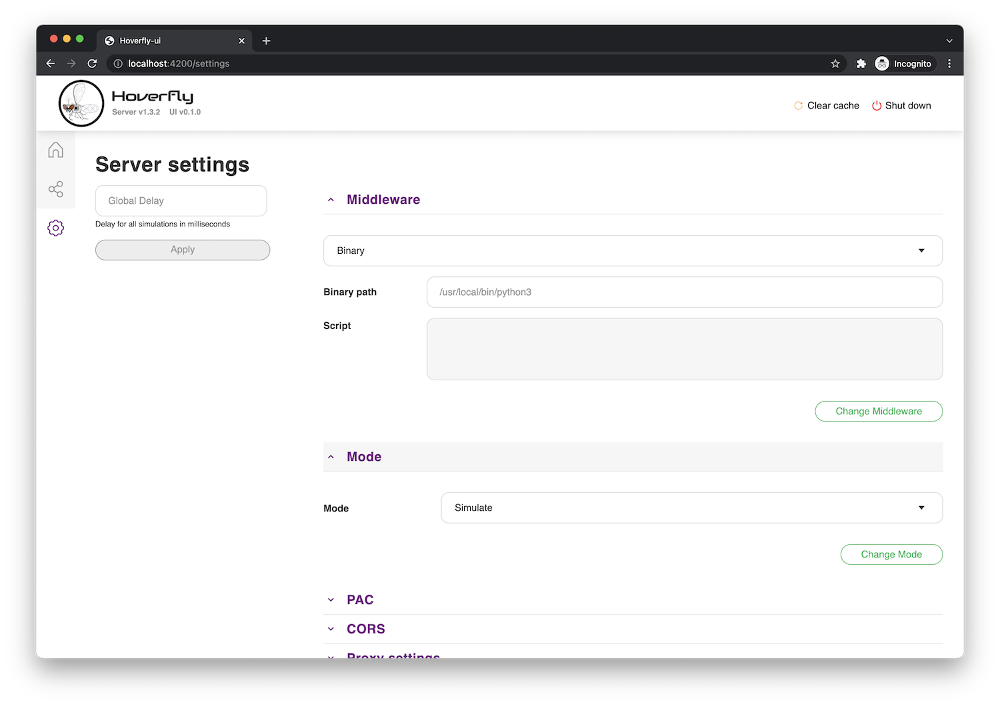

# Hoverfly UI

Hoverfly is developed by [SpectoLabs](https://specto.io/) and used to virtualize services. This project adds a neat UI
interface for working with the server.

## How does it look?






## Development

To prepare the dev environment, first thing is to install dependencies:

```shell
$ yarn install
```

Then all you need to do is to start it via simple command:

```shell
$ yarn start
```

It starts a webpack server on port `4200`.

Since it uses Hoverfly API, the hoverfly itself has to be started, for example:

```shell
$ hoverfly -webserver -dev

# or run with auth

$ hoverlfy -webserver -dev -auth -username admin -password admin
```

There's also a special command to run the linter:

```shell
$ yarn lint
```

## Contributing

Follow [CONTRIBUTING.md](CONTRIBUTING.md) and [CODE_OF_CONDUCT.md](CODE_OF_CONDUCT.md).
